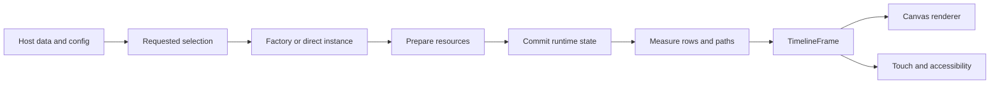

# Architecture

This document describes the 2.0 implementation. See [migration](MIGRATION_1_TO_2.md)
for changes from the published 1.1.0 artifact.

## Data flow

The host owns step progress and persistence. `TimelineView` forwards configuration and
lifecycle events to `TimelineViewController`. The controller coordinates strategies;
geometry belongs to the engine and drawing resources belong to the renderer.

## Strategy selection and failure handling

`TimelineRuntimeState` holds immutable requested configuration and two explicit selections:
`ByKey` or `Instance`. There are no independent override flags. A `ByKey` selection includes
a built-in fallback; `Instance` retains that fallback for a later explicit key selection.

A transition resolves the candidate and prepares resources before installing the state,
engine, renderer and registry together. A factory exception leaves the old selection in
place. Reused direct instances have their old configurations restored if preparation fails.
The prior measured frame remains available on failure. Custom implementations must validate
before mutating, accept restoration of their previous configuration, and make initialization
repeatable. External side effects inside a custom factory are outside the controller's rollback.

`setStrategy` explicitly returns both halves to factory/registry selection. Installing a
registry preserves direct instances. `replaceSteps` retains the current strategy and updates
its step data without rebuilding renderer resources.

`setConfig(TimelineConfig)` replaces the full declarative selection; `setConfig(math, ui)`
updates configuration while retaining direct instances. `getConfig()` returns the declarative
values and fallback strategies, not a serialization of manually installed engine instances.

The internal `TimelineBuiltIns` catalog supplies both public factories and default registry
providers. The global registry remains a compatibility entry point; prefer a local registry
for independent host screens and tests.
Built-in selection also resolves through registry providers. A registry created with
`registerDefaults = false` must supply the requested built-in fallback provider itself.

## Measurement and the frame

Measurement sets width, produces initial layout, measures text, expands declared content
rows, and rebuilds geometry. Engines opt in using `getContentRows` and `setStepExtents`;
unknown custom strategies are not assumed to be vertical.

Only a successful measurement replaces `TimelineFrame`. It owns copies of paths, layout,
text blocks, transforms and target bounds. Mutable text is snapshotted; applications should
also treat their span objects as immutable. Target bounds returned to accessibility are
copies. Clickability is bound to the current listeners without requiring remeasurement.

The renderer's compatibility path objects are restored from the frame for drawing. A failed
measurement therefore cannot mix a new path origin with old text or touch coordinates.
All view and engine updates are expected on the Android UI thread.

## Geometry contract

[TimelineLayoutEngine](timelineview/src/main/java/com/dmitrypokrasov/timelineview/math/TimelineLayoutEngine.kt)
contains configuration, width, path and complete-layout operations. `TimelineMathEngine`
extends it with deprecated coordinate getters for existing integrations.
[TimelineMathAdapter](timelineview/src/main/java/com/dmitrypokrasov/timelineview/math/TimelineMathAdapter.kt)
bridges a layout-first custom engine to that compatibility surface.

`TimelinePathGeometry` constructs rounded paths and uses their arc length for progress and
color splitting. `hasRoundedGeometry` prevents paint from rounding those paths again.
Sequential progress stops at the first incomplete step; independent progress colors each
incoming segment separately. Both modes expose one active progress marker.

## Cache ownership and lifecycle

- Engines invalidate derived layout/path data on config, width, extents or radius changes.
- A successful state update invalidates the frame; a successful measure installs a new one.
- Renderer text and bitmap caches are bounded and reset on renderer initialization.
- Lottie drawables are keyed by stable step identity and overlay role, paused while hidden,
  paused outside the drawn viewport, evicted when removed, and released on detach.
  Viewport culling includes scaled overlay bounds; returning overlays resume playback.
  The frame does not own animation playback.
- Offscreen steps are skipped during drawing. Layout still measures the complete dataset;
  an unbounded feed needs a recycling container.

## Compatibility boundaries

Existing renderer classes and factories remain available. The library stays one Android
module; optional animation extraction or a platform-independent geometry module can be
introduced later without adding layers to the host's API now. The standalone integration
build checks that consumers do not accidentally depend on project-internal source access.
